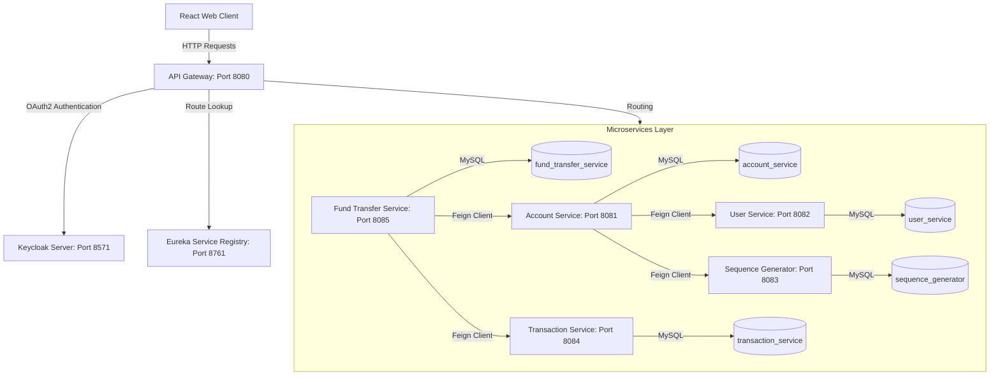

# Apex Bank: Spring Boot Microservices & React Web Portal 🏦💰

Apex Bank is a secure, distributed digital banking application designed using a **Microservices Architecture** with Spring Boot/Spring Cloud, integrated with **Keycloak Identity Provider** for secure OAuth2 authentication, and styled with a premium dark-themed **React + JavaScript + Tailwind CSS v4** frontend web portal.

---

## 🏛️ System Architecture

The application is structured into decoupled, independent services that register with a central discovery server and communicate internally using **OpenFeign** clients.



---

## 🛠️ Tech Stack Inventory

*   **Backend Core**: Java 17, Spring Boot 2.7.14, Spring Data JPA, Hibernate, Lombok
*   **Microservices Ecosystem**: Spring Cloud Gateway, OpenFeign RPC, Netflix Eureka Discovery
*   **Security & Identity**: Keycloak Identity Server (OIDC / OAuth2), Spring Security WebFlux
*   **Database**: MySQL Server
*   **Frontend**: React 19, Vite 8, JavaScript (JSX), Tailwind CSS v4, Lucide Icons, React Router Dom

---

## 👤 Microservices Directory

1.  **Service Registry (Eureka Server - Port `8761`)**: The directory phonebook where all services register their dynamic ports and IP configurations.
2.  **API Gateway (Spring Cloud Gateway - Port `8080`)**: Central doorway. Implements cross-origin CORS headers and inspects Keycloak JWT tokens before routing traffic to individual microservices.
3.  **User Service (Port `8082`)**: Registers and manages users. Connects to Keycloak via Admin Client to configure user profiles and login permissions.
4.  **Account Service (Port `8081`)**: Manages Savings and Checking accounts. Computes account balances and queries the *Sequence Generator* for new account numbers.
5.  **Sequence Generator (Port `8083`)**: Secure utility service generating conflict-free, sequential banking account numbers.
6.  **Transaction Service (Port `8084`)**: Logs debit and credit ledger operations, generating UUID-based transaction references.
7.  **Fund Transfer Service (Port `8085`)**: Orchestrates secure fund routing between accounts, calling *Account Service* for balance checks and *Transaction Service* to register ledger updates.

---

## 🚀 Getting Started

Follow these step-by-step instructions to configure and spin up the complete banking portal locally.

### Prerequisites:
- **Java 17** and **Maven** installed
- **Node.js** (v18+) and **npm** installed
- **MySQL Server** installed and running
- **Keycloak** (v21.0.1 or similar) downloaded

---

### Step 1: Database Initialization
Log into your MySQL command-line or client interface and create five independent database schemas:
```sql
CREATE DATABASE user_service;
CREATE DATABASE account_service;
CREATE DATABASE fund_transfer_service;
CREATE DATABASE transaction_service;
CREATE DATABASE sequence_generator;
```
*(Verify that each microservice configuration matches your local database credentials under `username` and `password` in their respective `application.yml` resource files).*

---

### Step 2: Keycloak Setup (Identity Provider)
Run Keycloak on port **`8571`** (since the API Gateway uses `8080`):
```bash
# If using Docker:
docker run -p 8571:8080 -e KEYCLOAK_ADMIN=admin -e KEYCLOAK_ADMIN_PASSWORD=admin keycloak/keycloak:21.0.1 start-dev

# If using standalone ZIP (Windows):
kc.bat start-dev --http-port 8571
```

1.  Access the admin console at `http://localhost:8571` and create a workspace realm named **`banking-service`**.
2.  Navigate to **Clients** -> click **Create Client**:
    - **Client ID**: `banking-service-client`
    - **Client Protocol**: `openid-connect`
3.  On the next page, toggle **Client Authentication** to **`ON`** (confidential client). Click Save.
4.  In the client settings:
    - **Valid Redirect URIs**: Add `http://localhost:8571/login/oauth2/code/keycloak` and `http://localhost:8080/*`
    - **Web Origins**: Add `*` (avoids CORS issues).
5.  Go to the **Credentials** tab and copy the **Client Secret** string.
6.  Open `API-Gateway` and `User-Service` `application.yml` files, and paste this secret key into:
    `client-secret: <YOUR_COPIED_SECRET>`
7.  Go to **Users** -> **Add User** -> Create username `super-user` and email `adamsanadi1234@gmail.com`. Go to credentials tab, set a password (e.g. `Ka3k@1411`), and turn **Temporary** to **`OFF`**.

---

### Step 3: Run the Backend Microservices
Run the services in this exact order:

1.  **Service-Registry**:
    ```bash
    cd Service-Registry
    mvn spring-boot:run
    ```
2.  **Core Services** (Wait 10 seconds for Eureka discovery synchronization):
    - `Sequence-Generator`
    - `User-Service`
    - `Account-Service`
    - `Transaction-Service`
    - `Fund-Transfer`
3.  **API-Gateway**:
    ```bash
    cd API-Gateway
    mvn spring-boot:run
    ```

*Verify that all services are online by loading the Eureka Registry panel at `http://localhost:8761`.*

---

### Step 4: Run the React Web Client

The React application features a floating developer toggle in the bottom-right corner. It supports two modes:
-   **Mock Mode (Default / Offline)**: Replicates the backend state using browser storage (`localStorage`) so developers can test all banking operations instantly without running Keycloak, MySQL, or Java microservices.
-   **Real API Mode**: Redirects REST operations through port `8080` (API Gateway) to execute actual Spring Boot controller logic.

```bash
# Navigate to the frontend directory
cd frontend

# Install package dependencies
npm install

# Run the dev server
npm run dev
```
Open **`http://localhost:5173`** in your browser.

---

## 💎 Features Checklist

- [x] **Central Gateway Integration**: Unified routing and CORS support.
- [x] **Secure OAuth2 Authorization**: Identity control via Keycloak.
- [x] **ATM Transaction Simulation**: Credit deposits and cash withdrawals.
- [x] **Real-time Funds Routing**: Fast intra-bank transfers.
- [x] **Admin KYC Approvals**: Administrative control to activate newly registered accounts.
- [x] **Dynamic Activity Charts**: Graphical transaction ratio widgets.
- [x] **Account Ledger Audits**: Color-coded transaction histories.